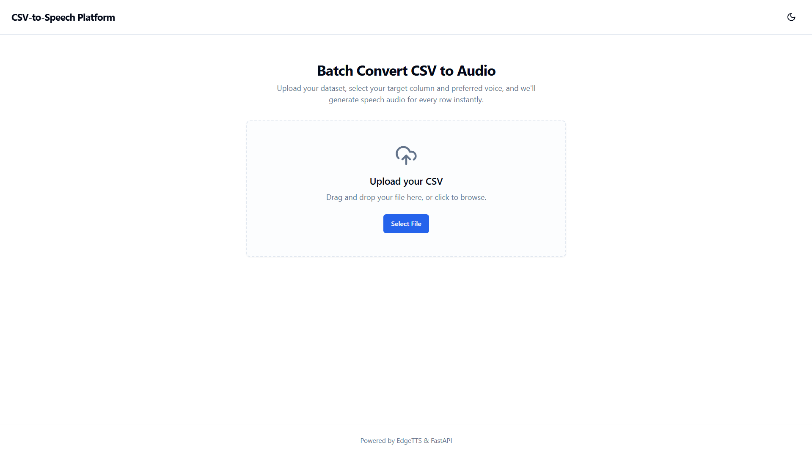
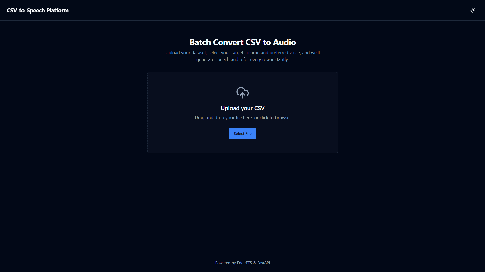
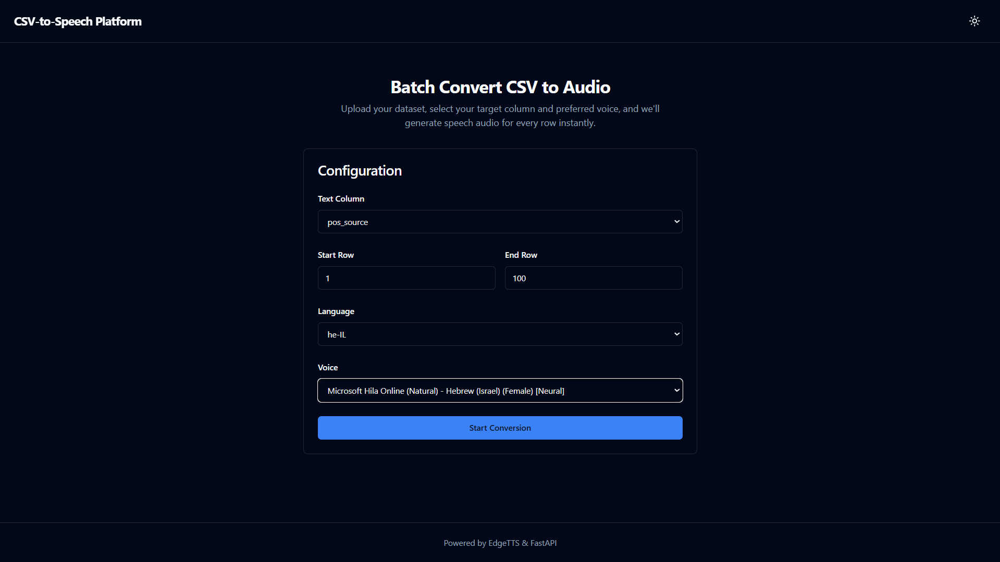
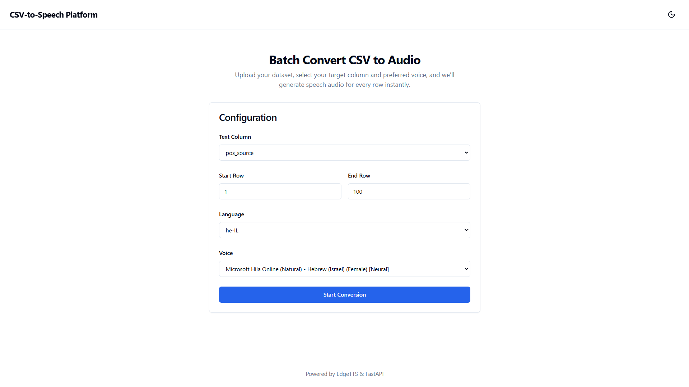
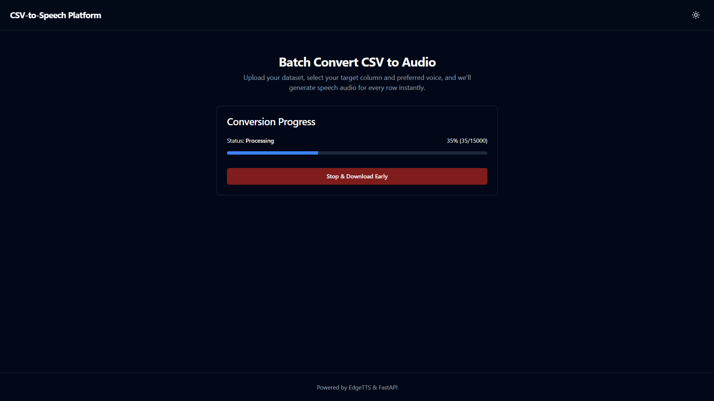
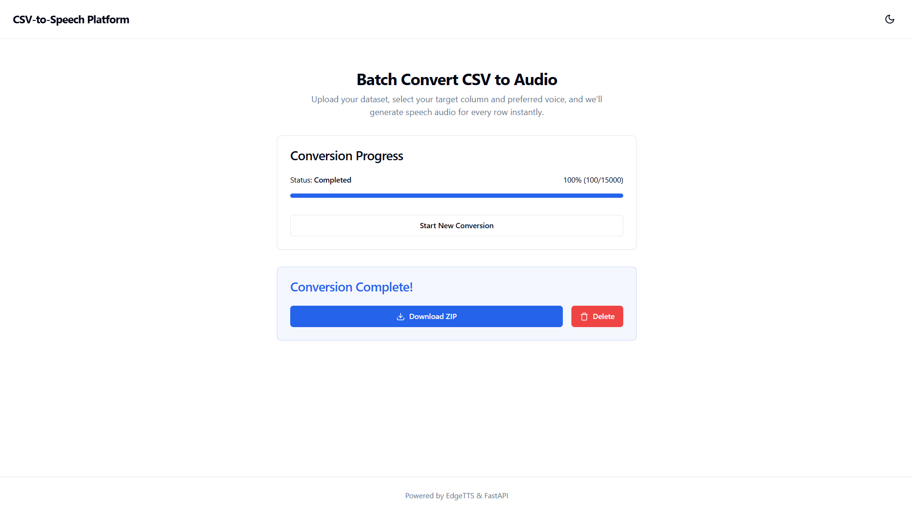
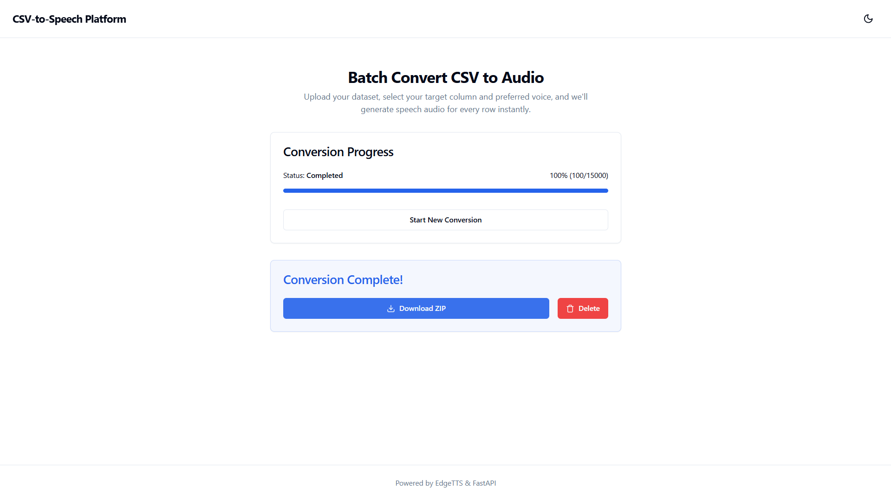
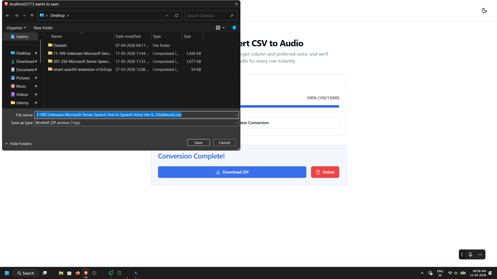

# CSV-to-Speech Batch Processing Platform


A highly concurrent, production-ready, full-stack platform that seamlessly transforms massive CSV datasets of text into thousands of individual synthesized audio files using Microsoft Edge TTS. Built heavily with Docker, React, and FastAPI.

## Motivation
> "My main motivation for this project is because an AI based startup required to train their Voice models using different languages and the data was made available in a CSV file. Per language there were more than 30k to 40k data points or sentences in a particular column that should be used to convert to an audio file. The manual method was time consuming, had severe rate limits, and needed payment. So I researched alternative ways to do the task and the result is this project."

## Features
- **Extreme Concurrency**: Optimized with Python `asyncio.Semaphore` to process up to 35 concurrent Edge TTS streams, drastically cutting down processing time for massive datasets.
- **Smart Range Slicing**: Need to process rows 20,000 to 25,000? Pick your start and end ranges seamlessly from the UI.
- **Dynamic File Generation**: Output files are neatly zipped and named dynamically using the format `[start_range]-[end_range]-[Language]-[voice].zip`.
- **Live WebSocket Progress**: Track thousands of rows completing in real-time on a beautifully designed dashboard.
- **Automated Lifecycle Management**: Automatic scrubbing of old CSV payloads and generated temporary audio artifacts, alongside a strict 3-day expiration lifecycle for output `.zip` files.
- **Early Termination**: Cancel a batch midway through, and instantly download a ZIP of everything processed up to that exact moment.

## Screenshots
*(Add screenshots of your working application here once deployed)*

### 1. Upload & Configuration

<br/>

<br/><br/><br/>

### 2. Upload CSV and Configure TTS Parameters

<br/>

<br/><br/><br/>

### 3. Live Progress Dashboard

<br/>

<br/><br/><br/>

### 4. Download & Management

<br/>

<br/><br/><br/>

## Tech Stack
- **Frontend**: React, Vite, TailwindCSS, Zustand (State Management), shadcn/ui.
- **Backend**: FastAPI, Python 3.11, WebSockets, Pandas, edge-tts, APScheduler.
- **Infrastructure**: NGINX, Docker, Docker Compose.

## Getting Started
Because the entire application is completely containerized, spinning up the project on any system is incredibly simple.

### Prerequisites
- [Git](https://git-scm.com/)
- [Docker](https://docs.docker.com/get-docker/) & [Docker Compose](https://docs.docker.com/compose/install/)

### Installation & Execution
1. **Clone the repository:**
   ```bash
   git clone https://github.com/predXpramad/csv-to-speech-platform.git
   cd csv-to-speech-platform
   ```

2. **Run with Docker Compose:**
   ```bash
   docker-compose up --build -d
   ```

3. **Access the Application:**
   Open your web browser and navigate to:
   [http://localhost:5173](http://localhost:5173)

### Stopping the Server
To safely stop the containers without losing your ZIP exports or internal state:
```bash
docker-compose stop
```
To completely bring everything down and delete the isolated network:
```bash
docker-compose down
```

## How It Works
1. Upload a valid CSV containing your textual data.
2. The system automatically reads the headers. Select the column that holds your sentences.
3. Choose the target Language and a Microsoft Neural Voice.
4. Input your desired row range (e.g., Row 1 to Row 15000).
5. Click **Start Conversion**. 
6. Watch the real-time progress via WebSocket.
7. Download the bundled `.zip` file natively or cancel early.

## Project Architecture
```text
.
├── backend/                  # FastAPI Application
│   ├── app/                  # Main Python Source
│   ├── Dockerfile            # Python 3.11 Image
│   ├── requirements.txt      # Backend Dependencies
├── frontend/                 # React Application
│   ├── src/                  # Components, Hooks, API logic
│   ├── Dockerfile            # Node / Alpine Image
│   ├── package.json          
├── nginx/                    # Reverse Proxy
│   ├── conf.d/               # Internal API/WS routing logic
├── storage/                  # Persistent Docker Volumes
│   ├── uploads/              # Temporary CSV payloads
│   ├── temp_audio/           # Raw .mp3 file fragments
│   ├── zip_exports/          # Final output bundles
├── docker-compose.yml        # Orchestration Config
```

## License
MIT License.
